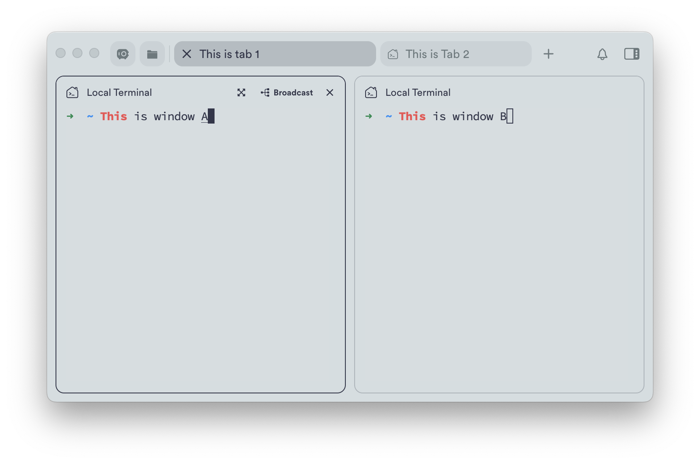
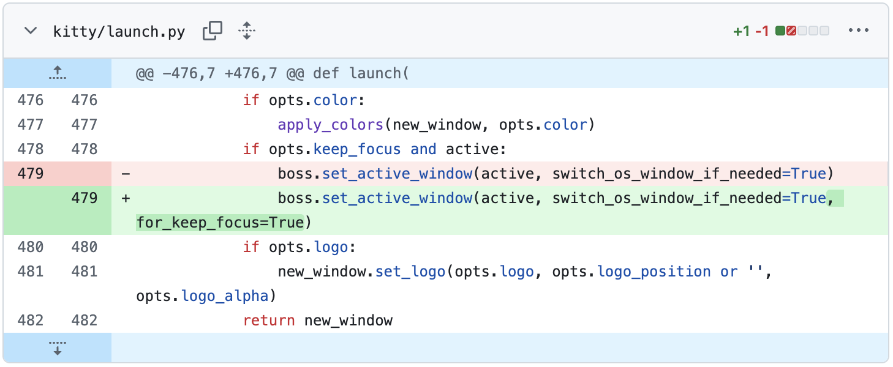

# 用户实验介绍：任务 2

## 实验环境配置

请通过以下命令配置环境，用于测试编辑结果：

```bash
conda create --name env_1 python=3.9 -y
conda activate env_1
```

## 任务介绍

Kitty 是一个现代化的、功能强大的 GPU 加速终端模拟器。在 Kitty 终端中,窗口(window)和标签页(tab)的关系是嵌套的层级结构，例如：

```
├── Tab 1 (当前活跃标签页)
│   ├── Window A (vim编辑器) ← 当前焦点在这里
│   └── Window B (运行服务器)
└── Tab 2
    └── Window C (日志查看)
```

如下图所示：
* 当前终端中有两个 Tab（标签页） 1 和 2， 其中当前展示的是 Tab 1；
* Tab 1 中有两个 Window（窗口） A 和 B，当前的 focus 在 Window A 上：


假设当前用户是从 Tab 2 的 Window C 切换过来的，则：

* 当前的 Tab 历史为：Tab 2
* 当前的 Window 历史为：Window C

记录Tab 和 Window 的历史，是方便用户能够通过快捷键，快速切换到上一次的 focus 位置。

当用户使用命令`kitty @ launch --keep-focus --type=tab`打开一个新标签页 Tab 3，并在其中创建一个新窗口 Window D，该命令中的`--keep-focus`参数确保了当前的 focus 仍然在 Tab 1 上。

```
├── Tab 1 (当前活跃标签页)
│   ├── Window A (vim编辑器) ← 当前焦点在这里
│   └── Window B (运行服务器)
├── Tab 2 
│   └── Window C (日志查看)
└── Tab 3
    └── Window D (新窗口)
```

该命令的实现方法是：创建了一个新标签页 Tab 3 和 新窗口 Window D 时焦点就切换到了 Tab 3 的 Window D，接着程序再主动将焦点切换回 Tab 1 上。

但这种实现方法会把这个切换的过程记录到 Tab 和 Window 的历史中，变成了：

* Tab 历史为：Tab 2, Tab 1, Tab 3
* 当前的 Window 历史为：Window C, Window A, Window D

此时用户通过快捷键切换到上一次 focus 的位置时，期待的是 Tab 2 的 Window C，但是根据 Tab 和 Window 的历史记录，实际切换到的是 Tab 3 的 Window D。

因此，该任务就是要在用户使用 `keep_focus`的时候，修复 Tab 和 Window 的历史记录，确保用户通过快捷键切换到上一次 focus 的位置时，能够正确切换到 Tab 2 的 Window C，而不是 Tab 3 的 Window D。

初始编辑如下图所示：



你可以前往 [`kitty/launch.py`](kitty/launch.py)，复制以下内容完成该初始修改：

```python
    boss.set_active_window(active, switch_os_window_if_needed=True, for_keep_focus=True)
```

请你在完成该初始修改后，找到所有受到该编辑影响的位置，并完成后续修改。

> ⚠️ **温馨提示**
>
> * **初始编辑包含在内**，一共需要完成 **8** 处修改
>
> * 所有的修改都不需要新增/删除/重命名任何文件
>
> * 你可以在项目根目录下运行 `python count.py` 来查看和统计已经完成的编辑数量
>
> * 编辑数量**仅供参考**，请根据[验证修改](#验证修改)来判断是否完成修改目标

## 编辑描述

当你需要输入编辑描述时，你可以直接复制以下内容：

```bash
When using --keep-focus ensure active history list is not affected
```

如果你所在的实验组使用的后端模型是 Claude Code，你可以输入任意内容和 Claude Code 沟通。

## 验证修改

请运行一下命令验证修改是否成功

```bash
python -m test.run
```

当修改正确时，你应该看到以下内容：

```bash
Test 1 passed.
Test 2 passed.
Test 3 passed.
Test 4 passed.
Test 5 passed.
Test 6 passed.
Test 7 passed.
Test 8 passed.
Test 9 passed.
Test 10 passed.
Test 11 passed.
Test 12 passed.
```

恭喜你成功完成该任务，请你：

1. 点击右上角的保存按钮，保存你的活动记录（保存为当前文件夹下的`{用户id}-2-{你所在的组别}.json`，例如`a94c-2-A.json`）
2. 停止录屏
3. 告知实验负责人

在完成**所有任务后**，请打包每个任务的 `{用户id}-2-{你所在的组别}.json` 文件和 录屏文件，提交给实验负责人。
